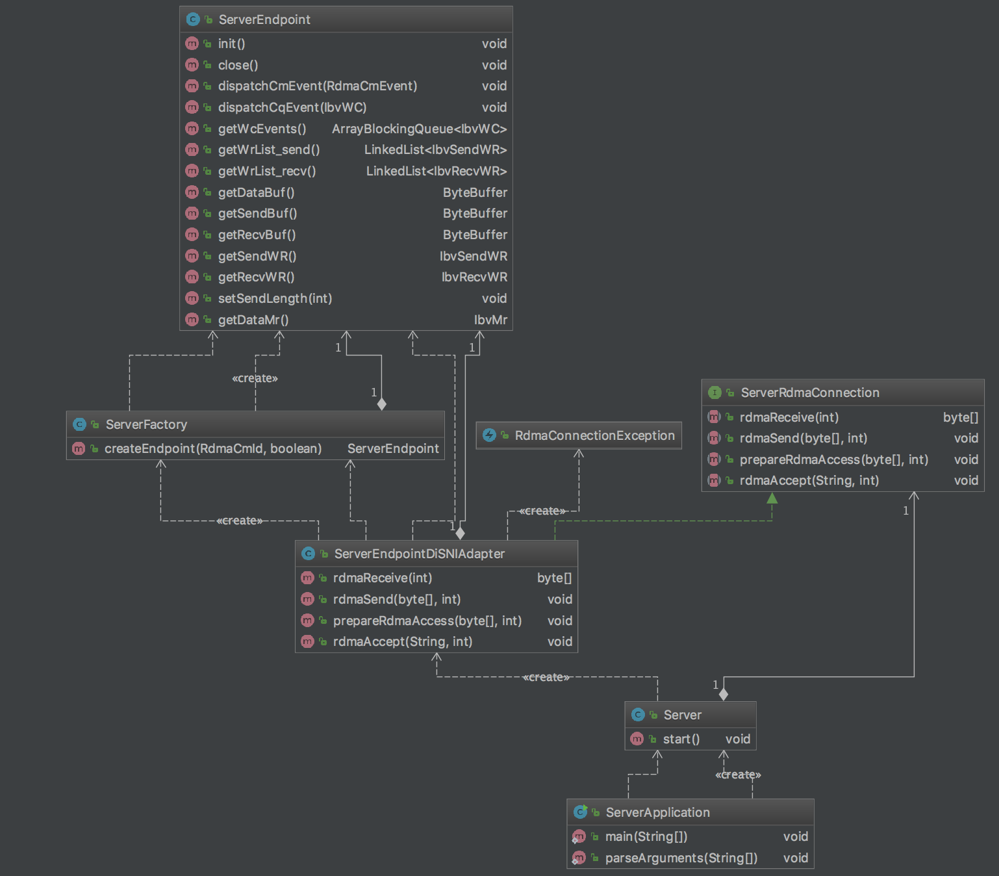
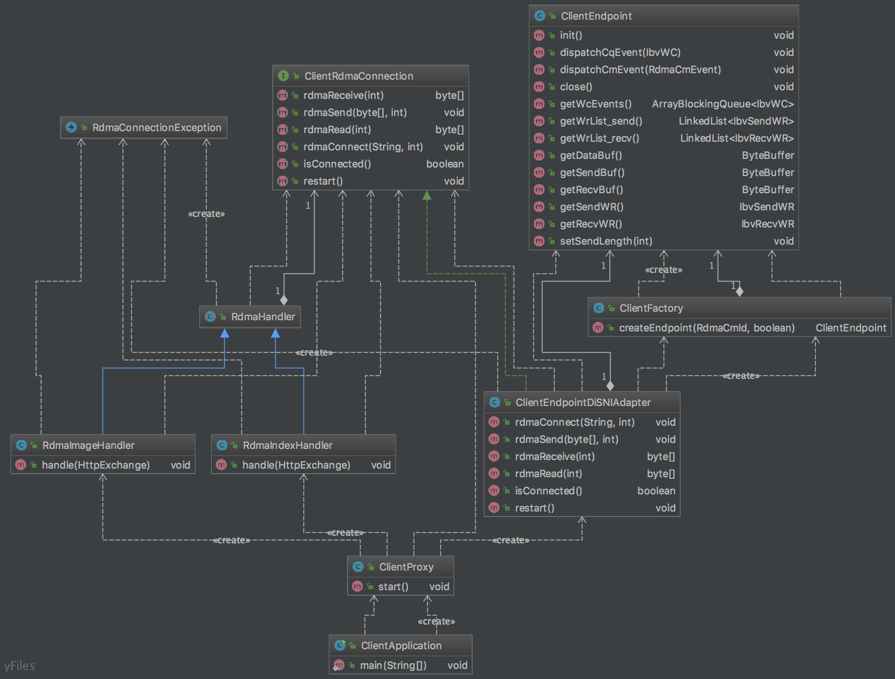

# ACN - Assignment 8

## Getting started

### Setup

To redirect Mozilla Firefox brower to the client proxy:

 - Edit -> Preferences -> Advanced -> Network -> Settings -> Manual Proxy Configurations ->
HTTP Proxy: 127.0.0.1
Port: 8000
 - OK
 
### To try it out

0. Don't forget

- export LD LIBRARY PATH=/usr/local/lib

1. To compile the project (A compiled version are already in target folder):

- $ mvn clean compile assembly:single

2. To run the server:

- $ cd server/target
- $ java -jar RDMAServer-*.jar -a 10.0.2.15

3. To run the client-proxy:

- $ cd RDMAClientProxy/target
- $ java -jar RDMAClientProxy-*.jar -a 10.0.2.15

 ## General Info about the system
 
 - We used version 1.0 of DiSNI
 - The program runs in the VM that is provided to us (without any changes)
 - The system is able to handle multiple clients (in parallel)
 - The client proxy detects when it is disconnected and returns back 504 error to the browser
 - After client disconnection, the server will go back to acceptRdma() state to accept new connections
 - The client is not capable of reconnecting with the server, if it failed to connect once.
 
 ### Remark
- The client cannot reconnect because DiSNI library doesn't support this. Even if we deregister buffers, close endpoints and endpointGroups in the library and try to connect again an internal error about memory registration failure occurs. One has to use newer versions to achieve this. We tried to deregister the memory by ourselves, but it doesn't work. 

## Info about the design
- We created an interface both in the client and the server by using the adapter design pattern to manage easier the DiSNI API. 
 
 ### Server State
 
  
 
 ### Client Proxy State
 
  
 
 

